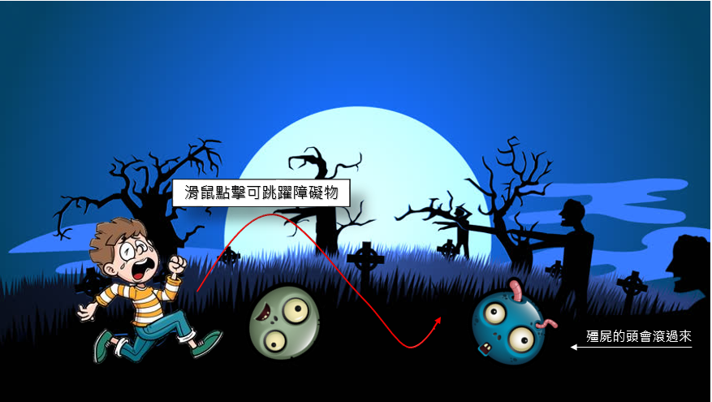

# 第三組
## 專案主題： Over the dead body :skull:

### 成員：

* Name 1 應用英語系3A 0431081 劉芊華 
* Name 2 應用英語系3A 0431025 黃嘉貞
* Name 3 應用英語系3A 0431005 楊韋襦
* Name 4 應用日語系3B 0432014 張簡加珍
* Name 5 金融系3B 0441004 陳柔潔

### 專案簡介：

* 遊戲內容為主角需要逃離一個充滿殭屍的城鎮，玩家可以透過滑鼠點擊跳躍障礙物(殭屍的頭)以逃離城鎮。 :runner:

### 專案畫面簡介：

