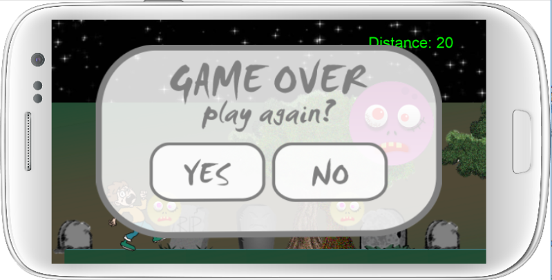

# 第三組
## 專案主題： Over the dead body :skull:

### 成員：

* Name 1 應用英語系3A 0431081 劉芊華 
* Name 2 應用英語系3A 0431025 黃嘉貞
* Name 3 應用英語系3A 0431005 楊韋襦
* Name 4 應用日語系3B 0432014 張簡加珍
* Name 5 金融系3B 0441004 陳柔潔

### 專案簡介：

* 內容：遊戲內容為主角需要逃離一個充滿殭屍的城鎮，玩家可以透過滑鼠點擊跳躍障礙物(殭屍的頭)以逃離城鎮。 :runner:
* 參考範例為ch 11

### 專案畫面簡介：

### 工作分配：

* 簡報：陳柔潔、楊韋襦
* 報告：楊韋襦
* 音效：張簡加珍
* 程式：陳柔潔、黃嘉貞、劉芊華、張簡加珍
* 美術
1. 楊韋襦

2. 黃嘉貞
#### 
#### 
#### 
#### 
3. 劉芊華
#### 

### 程式分配：主要參考範例 CH.11

* 陳柔潔：音效

* 黃嘉貞：背景

* 劉芊華：主角人物

* 張簡加珍：怪物、魔王

